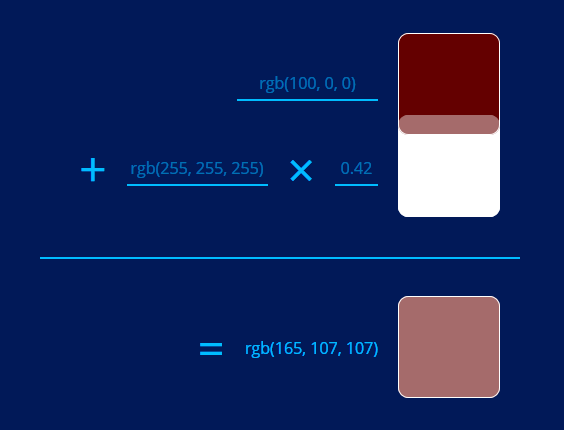

# RGB Alpha Blender
A simple tool that gives you the result if you blend one RGBA color with a RGB background color and gives you.

Sometimes, even in HTML land, you run into situations where alpha blending just isn't going to work.  This was inspired by
[Datamaps](https://datamaps.github.io/)' lack of support for alphas in their choropleth maps!

## Quick Start
Just put this on a web server somewhere; maybe even just open it in a web browser!  It's just static Javascript and HTML.

## Usage
Enter the background rgb value into the first field, enter the foreground rgb value into the second field, and enter 
the foreground alpha, and check out the results.
 
 